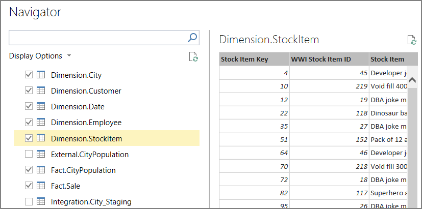
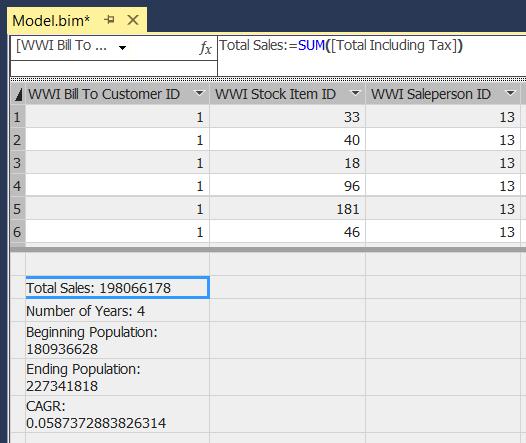
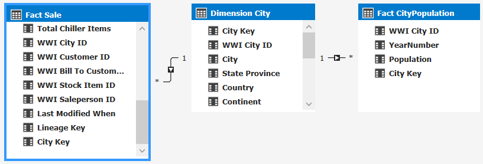
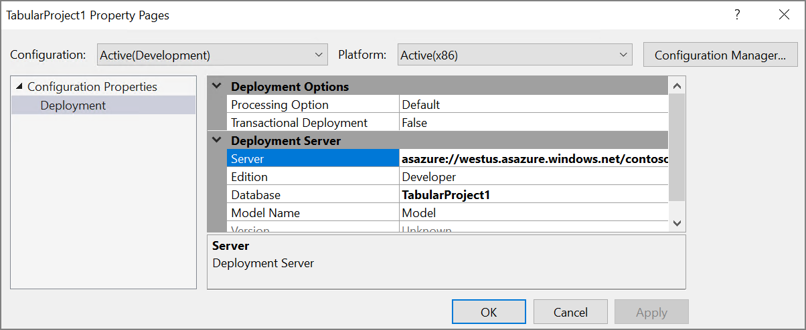
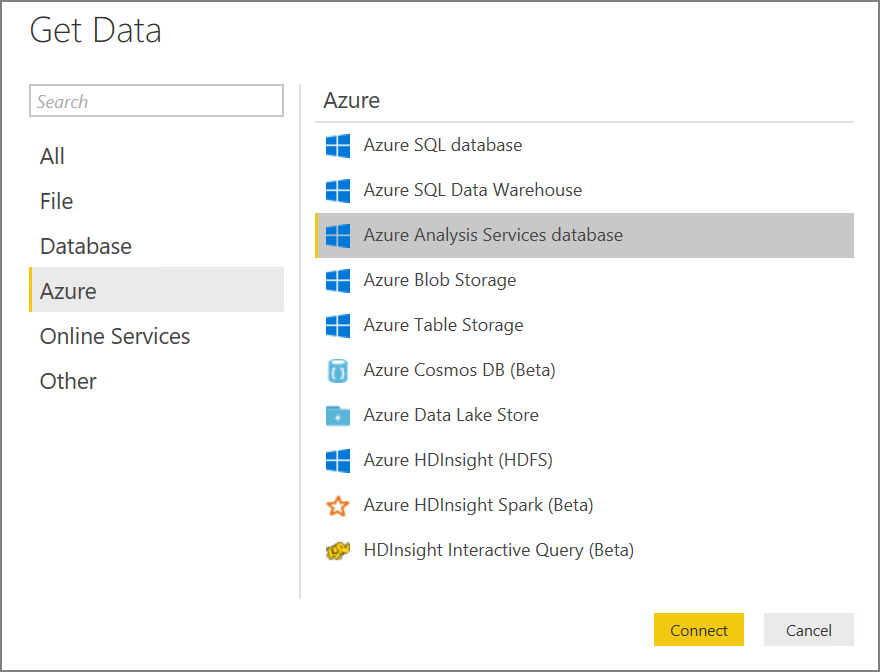

# Automated enterprise BI with SQL Data Warehouse and Azure Data Factory

This reference architecture shows how to perform incremental loading in an [ELT](https://docs.microsoft.com/azure/architecture/data-guide/relational-data/etl#extract-load-and-transform-elt) (extract-load-transform) pipeline. It uses Azure Data Factory to automate the ELT pipeline. The pipeline incrementally moves the latest OLTP data from an on-premises SQL Server database into SQL Data Warehouse. Transactional data is transformed into a tabular model for analysis.


For more information about this reference architectures and guidance about best practices, see the article [Automated enterprise BI with SQL Data Warehouse and Azure Data Factory](https://docs.microsoft.com/azure/architecture/reference-architectures/data/enterprise-bi-adf) on the Azure Architecture Center.

The deployment uses [Azure Building Blocks](https://github.com/mspnp/template-building-blocks/wiki) (azbb), a command line tool that simplifies deployment of Azure resources.

## Deploy the solution

### Prerequisites

1. Clone, fork, or download the zip file for this repository.

2. Install [Azure CLI 2.0](https://docs.microsoft.com/cli/azure/install-azure-cli?view=azure-cli-latest).

3. Install the [Azure building blocks](https://github.com/mspnp/template-building-blocks/wiki/Install-Azure-Building-Blocks) npm package.

   ```bash
   npm install -g @mspnp/azure-building-blocks
   ```
   > Note: There is a limitation in version 2.2.3 which will cause an error when deploying into regions that return a large list of VM SKUs when queried.  A fix has been included via https://github.com/mspnp/template-building-blocks/pull/420.  You can get the latest version including this fix from the repo by doing:
   > 1. `git clone git@github.com:mspnp/template-building-blocks.git`
   > 1. `cd template-building-blocks`
   > 1. `npm install -g .`

4. From a command prompt, bash prompt, or PowerShell prompt, sign into your Azure account as follows:

   ```bash
   az login
   ```

### Variables

The steps that follow include some user-defined variables. You will need to replace these with values that you define.

- `<data_factory_name>`. Data Factory name.
- `<analysis_server_name>`. Analysis Services server name.
- `<active_directory_upn>`. Your Azure Active Directory user principal name (UPN). For example, `user@contoso.com`.
- `<data_warehouse_server_name>`. SQL Data Warehouse server name.
- `<data_warehouse_password>`. SQL Data Warehouse administrator password.
- `<resource_group_name>`. The name of the resource group.
- `<region>`. The Azure region where the resources will be deployed.
- `<storage_account_name>`. Storage account name. Must follow the [naming rules](https://docs.microsoft.com/azure/architecture/best-practices/naming-conventions#naming-rules-and-restrictions) for Storage accounts.
- `<sql-db-password>`. SQL Server login password.

### Deploy Azure Data Factory

1. Navigate to the `azure\templates` folder of the GitHub repository.

2. Run the following Azure CLI command to create a resource group.

    ```bash
    az group create --name <resource_group_name> --location <region>
    ```

    Specify a region that supports SQL Data Warehouse, Azure Analysis Services, and Data Factory v2. See [Azure Products by Region](https://azure.microsoft.com/global-infrastructure/services/)

3. Run the following command

    ```
    az group deployment create --resource-group <resource_group_name> \
        --template-file adf-create-deploy.json \
        --parameters factoryName=<data_factory_name> location=<location>
    ```

Next, use the Azure Portal to get the authentication key for the Azure Data Factory [integration runtime](https://docs.microsoft.com/azure/architecture/best-practices/naming-conventions#naming-rules-and-restrictions/azure/data-factory/concepts-integration-runtime), as follows:

1. In the [Azure Portal](https://portal.azure.com/), navigate to the Data Factory instance.

2. In the Data Factory blade, click **Author & Monitor**. This opens the Azure Data Factory portal in another browser window.

    

3. In the Azure Data Factory portal, select the briefcase icon (**Manage**).

4. Under **Connections**, select **Integration Runtimes**.

5. Select **sourceIntegrationRuntime**.

    > The portal will show the status as "unavailable". This is expected until you deploy the on-premises server.

6. Find **Key1** and copy the value of the authentication key.

You will need the authentication key for the next step.

### Deploy the simulated on-premises server

This step deploys a VM as a simulated on-premises server, which includes SQL Server 2017 and related tools. It also loads the [Wide World Importers OLTP database](https://docs.microsoft.com/sql/sample/world-wide-importers/wide-world-importers-oltp-database) into SQL Server.

1. Navigate to the `onprem\templates` folder of the repository.

2. In the `onprem.parameters.json` file, search for `adminPassword`. This is the password to log into the SQL Server VM. Replace the value with another password.

3. In the same file, search for `SqlUserCredentials`. This property specifies the SQL Server account credentials. Replace the password with a different value.

4. In the same file, paste the Integration Runtime authentication key into the `IntegrationRuntimeGatewayKey` parameter, as shown below:

    ```json
    "protectedSettings": {
        "configurationArguments": {
            "SqlUserCredentials": {
                "userName": ".\\adminUser",
                "password": "<sql-db-password>"
            },
            "IntegrationRuntimeGatewayKey": "<authentication key>"
        }
    ```

5. Run the following command.

    ```bash
    azbb -s <subscription_id> -g <resource_group_name> -l <region> -p onprem.parameters.json --deploy
    ```

This step may take 20 to 30 minutes to complete. It includes running a [DSC](https://docs.microsoft.com/azure/architecture/best-practices/naming-conventions#naming-rules-and-restrictions/powershell/dsc/overview) script to install the tools and restore the database.

> Note: The template contains a network security group which allows inbound RDP access to the sql-vm1 virtual machine from the internet to support connecting in a later step.  You should edit the inbound rules on `ra-bi-onprem-nsg` to only allow connections from your network.

### Deploy Azure resources

This step provisions SQL Data Warehouse, Azure Analysis Services, and Data Factory.

1. Navigate to the `azure\templates` folder of the GitHub repository.

2. Run the following Azure CLI command. Replace the parameter values shown in angle brackets.

    ```bash
    az group deployment create --resource-group <resource_group_name> \
     --template-file azure-resources-deploy.json \
     --parameters "dwServerName"="<data_warehouse_server_name>" \
     "dwAdminLogin"="adminuser" "dwAdminPassword"="<data_warehouse_password>" \
     "storageAccountName"="<storage_account_name>" \
     "analysisServerName"="<analysis_server_name>" \
     "analysisServerAdmin"="<user@contoso.com>"
    ```

    - The `storageAccountName` parameter must follow the [naming rules](https://docs.microsoft.com/azure/architecture/best-practices/naming-conventions#naming-rules-and-restrictions) for Storage accounts.
    - For the `analysisServerAdmin` parameter, use your Azure Active Directory user principal name (UPN).

3. Run the following Azure CLI command to get the access key for the storage account. You will use this key in the next step.

    ```bash
    az storage account keys list -n <storage_account_name> -g <resource_group_name> --query "[0].value"
    ```

4. Run the following Azure CLI command. Replace the parameter values shown in angle brackets.

    ```bash
    az group deployment create --resource-group <resource_group_name> \
    --template-file adf-pipeline-deploy.json \
    --parameters "factoryName"="<data_factory_name>" \
    "sinkDWConnectionString"="Server=tcp:<data_warehouse_server_name>.database.windows.net,1433;Initial Catalog=wwi;Persist Security Info=False;User ID=adminuser;Password=<data_warehouse_password>;MultipleActiveResultSets=False;Encrypt=True;TrustServerCertificate=False;Connection Timeout=30;" \
    "blobConnectionString"="DefaultEndpointsProtocol=https;AccountName=<storage_account_name>;AccountKey=<storage_account_key>;EndpointSuffix=core.windows.net" \
    "sourceDBConnectionString"="Server=sql1;Database=WideWorldImporters;User Id=adminuser;Password=<sql-db-password>;Trusted_Connection=True;"
    ```

    The connection strings have substrings shown in angle brackets that must be replaced. For `<storage_account_key>`, use the key that you got in the previous step. For `<sql-db-password>`, use the SQL Server account password that you specified in the `onprem.parameters.json` file previously.

### Run the data warehouse scripts

1. In the [Azure Portal](https://portal.azure.com/), find the on-premises VM, which is named `sql-vm1`. The user name and password for the VM are specified in the `onprem.parameters.json` file.

2. Click **Connect** and use Remote Desktop to connect to the VM.

3. From your Remote Desktop session, open a command prompt and navigate to the following folder on the VM:

    ```
    cd C:\SampleDataFiles\azure-data-factory-sqldw-elt-pipeline\azure\sqldw_scripts
    ```

4. Run the following command:

    ```
    deploy_database.cmd -S <data_warehouse_server_name>.database.windows.net -d wwi -U adminuser -P <data_warehouse_password> -N -I
    ```

    For `<data_warehouse_server_name>` and `<data_warehouse_password>`, use the data warehouse server name and password from earlier.

To verify this step, you can use SQL Server Management Studio (SSMS) to connect to the SQL Data Warehouse database. You should see the database table schemas.

### Run the Data Factory pipeline

1. In the Azure Portal, navigate to the Data Factory instance that was created earlier.

1. In the Data Factory blade, click **Author & Monitor**. This opens the Azure Data Factory portal in another browser window.

    

1. In the Azure Data Factory portal, select the pencil icon (**Author**).

1. In the Author view, select Pipelines, MasterPipeline then select Add trigger, Trigger now.

    

1. In the Azure Data Factory portal, select the gauge icon (**Monitor**).

1. Verify that the pipeline completes successfully. It can take a few minutes.

    


## Build the Analysis Services model

In this step, you will create a tabular model that imports data from the data warehouse. Then you will deploy the model to Azure Analysis Services.

**Create a new tabular project**

1. From your Remote Desktop session, launch SQL Server Data Tools 2015.

2. Select **File** > **New** > **Project**.

3. In the **New Project** dialog, under **Templates**, select  **Business Intelligence** > **Analysis Services** > **Analysis Services Tabular Project**.

4. Name the project and click **OK**.

5. In the **Tabular model designer** dialog, select **Integrated workspace**  and set **Compatibility level** to `SQL Server 2017 / Azure Analysis Services (1400)`.

6. Click **OK**.


**Import data**

1. In the **Tabular Model Explorer** window, right-click the project and select **Import from Data Source**.

2. Select **Azure SQL Data Warehouse** and click **Connect**.

3. For **Server**, enter the fully qualified name of your Azure SQL Data Warehouse server. You can get this value from the Azure Portal. For **Database**, enter `wwi`. Click **OK**.

4. In the next dialog, choose **Database** authentication and enter your Azure SQL Data Warehouse user name and password, and click **OK**.

5. In the **Navigator** dialog, select the checkboxes for the **Fact.\*** and **Dimension.\*** tables.

    

6. Click **Load**. When processing is complete, click **Close**. You should now see a tabular view of the data.

**Create measures**

1. In the model designer, select the **Fact Sale** table.

2. Click a cell in the the measure grid. By default, the measure grid is displayed below the table.

    

3. In the formula bar, enter the following and press ENTER:

    ```
    Total Sales:=SUM('Fact Sale'[Total Including Tax])
    ```

4. Repeat these steps to create the following measures:

    ```
    Number of Years:=(MAX('Fact CityPopulation'[YearNumber])-MIN('Fact CityPopulation'[YearNumber]))+1

    Beginning Population:=CALCULATE(SUM('Fact CityPopulation'[Population]),FILTER('Fact CityPopulation','Fact CityPopulation'[YearNumber]=MIN('Fact CityPopulation'[YearNumber])))

    Ending Population:=CALCULATE(SUM('Fact CityPopulation'[Population]),FILTER('Fact CityPopulation','Fact CityPopulation'[YearNumber]=MAX('Fact CityPopulation'[YearNumber])))

    CAGR:=IFERROR((([Ending Population]/[Beginning Population])^(1/[Number of Years]))-1,0)
    ```

    

For more information about creating measures in SQL Server Data Tools, see [Measures](https://docs.microsoft.com/sql/analysis-services/tabular-models/measures-ssas-tabular).

**Create relationships**

1. In the **Tabular Model Explorer** window, right-click the project and select **Model View** > **Diagram View**.

2. Drag the **[Fact Sale].[City Key]** field to the **[Dimension City].[City Key]** field to create a relationship.

3. Drag the **[Face CityPopulation].[City Key]** field to the **[Dimension City].[City Key]** field.

    

**Deploy the model**

1. From the **File** menu, choose **Save All**.

2. In **Solution Explorer**, right-click the project and select **Properties**.

3. Under **Server**, enter the URL of your Azure Analysis Services instance. You can get this value from the Azure Portal. In the portal, select the Analysis Services resource, click the Overview pane, and look for the **Server Name** property. It will be similar to `asazure://westus.asazure.windows.net/contoso`. Click **OK**.

    

4. In **Solution Explorer**, right-click the project and select **Deploy**. Sign into Azure if prompted. When processing is complete, click **Close**.

5. In the Azure portal, view the details for your Azure Analysis Services instance. Verify that your model appears in the list of models.

    

## Analyze the data in Power BI Desktop

In this step, you will use Power BI to create a report from the data in Analysis Services.

1. From your Remote Desktop session, launch Power BI Desktop.

2. In the Welcome Scren, click **Get Data**.

3. Select **Azure** > **Azure Analysis Services database**. Click **Connect**

    

4. Enter the URL of your Analysis Services instance, then click **OK**. Sign into Azure if prompted.

5. In the **Navigator** dialog, expand the tabular project, select the model, and click **OK**.

2. In the **Visualizations** pane, select the **Table** icon. In the Report view, resize the visualization to make it larger.

6. In the **Fields** pane, expand **Dimension City**.

7. From **Dimension City**, drag **City** and **State Province** to the **Values** well.

9. In the **Fields** pane, expand **Fact Sale**.

10. From **Fact Sale**, drag **CAGR**, **Ending Population**,  and **Total Sales** to the **Value** well.

11. Under **Visual Level Filters**, select **Ending Population**. Set the filter to "is greater than 100000" and click **Apply filter**.

12. Under **Visual Level Filters**, select **Total Sales**. Set the filter to "is 0" and click **Apply filter**.


The table now shows cities with population greater than 100,000 and zero sales. CAGR  stands for Compounded Annual Growth Rate and measures the rate of population growth per city. You could use this value to find cities with high growth rates, for example. However, note that the values for CAGR in the model aren't accurate, because they are derived from sample data.

To learn more about Power BI Desktop, see [Getting started with Power BI Desktop](https://docs.microsoft.com/power-bi/desktop-getting-started).
